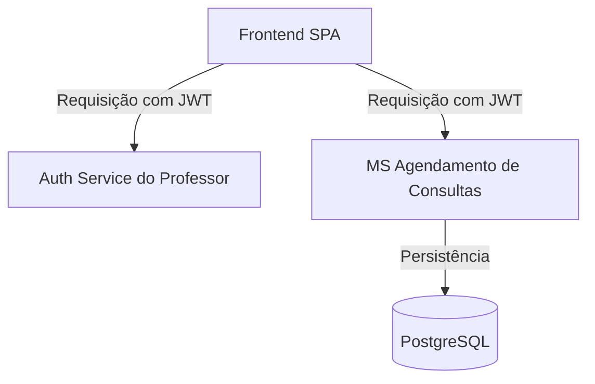

# 🏥 MS Agendamento de Consultas

Microsserviço Java/Spring Boot responsável pelo **agendamento de consultas veterinárias**, garantindo regras de negócio como prevenção de conflitos de horários, cancelamentos com antecedência mínima e integração com autenticação via JWT.

Faz parte do **Sistema Distribuído para Gestão de Clínicas Veterinárias**, desenvolvido como projeto acadêmico para demonstrar **arquitetura de microsserviços** com integração entre diferentes tecnologias (Java, Python, Node.js) e um serviço de autenticação centralizado.

---

## 🚀 Tecnologias Utilizadas

- **Java 21** + **Spring Boot 3.2.x**
- **Spring Web / Spring Data JPA**
- **PostgreSQL** (banco de dados dedicado do microserviço)
- **JWT** (integração com serviço de autenticação do professor)
- **Springdoc OpenAPI 3** (documentação automática da API)
- **Maven** (gerenciamento de dependências)

---

## 📋 Funcionalidades

✅ **Agendamento de consultas** com validação de horário e disponibilidade  
✅ **Prevenção de conflitos de agenda** para o mesmo veterinário  
✅ **Cancelamento de consultas** permitido apenas até 2 horas de antecedência  
✅ **Listagem de horários disponíveis** por veterinário e data  
✅ **Integração com autenticação JWT** para proteger endpoints  
✅ **Documentação interativa** via Swagger UI  

---

## 🔐 Autenticação

Todos os endpoints são protegidos e exigem um token JWT válido, obtido via serviço de autenticação central do professor.

**Exemplo de uso do header:**
```http
Authorization: Bearer <token_fornecido_pelo_professor>
```

---

## 📡 Endpoints Principais

| Método | Endpoint                                   | Descrição                        |
|-------|-------------------------------------------|--------------------------------|
| `GET` | `/api/v1/consultas`                       | Lista todas as consultas       |
| `POST`| `/api/v1/consultas`                       | Agenda uma nova consulta       |
| `DELETE`| `/api/v1/consultas/{id}/cancelar`       | Cancela uma consulta existente |
| `POST`| `/api/v1/consultas/horarios-disponiveis`  | Lista horários livres          |
| `GET` | `/api/v1/veterinarios`                    | Lista todos os veterinários    |
| `GET` | `/api/v1/health`                          | Health check do microsserviço  |

---

## 🎯 Regras de Negócio

- ⏰ **Horário comercial:** 08:00 às 18:00  
- ⛔ **Cancelamento:** apenas até 2 horas antes da consulta  
- ❌ **Conflitos de agenda:** não são permitidos  
- 🔑 **JWT obrigatório:** todas as rotas são protegidas

---

## 🛠️ Como Executar Localmente

### Pré-requisitos

- **Java 21**
- **Maven 3.8+**
- **PostgreSQL** rodando localmente

### Passo a Passo

```bash
# 1. Clonar o repositório
git clone https://github.com/Vital-Caja-Vet/ms-agendamento-consultas.git
cd ms-agendamento-consultas

# 2. Criar o banco no PostgreSQL
psql -U postgres -c "CREATE DATABASE ms_agendamento_consultas;"

# 3. Configurar o application.properties (já incluso)
spring.datasource.url=jdbc:postgresql://localhost:5432/ms_agendamento_consultas
spring.datasource.username=postgres
spring.datasource.password=suasenha

# 4. Rodar o projeto
mvn spring-boot:run
```

Após inicializar, acesse:

📄 **Swagger UI:** [http://localhost:8084/api/v1/apidocs](http://localhost:8084/api/v1/apidocs)  
📄 **API Docs (JSON):** [http://localhost:8084/api/v1/docs/apispec_1.json](http://localhost:8084/api/v1/docs/apispec_1.json)

---

## 📊 Exemplo de Uso via cURL

```bash
# Agendar uma consulta
curl -X POST http://localhost:8084/api/v1/consultas   -H "Authorization: Bearer token_jwt"   -H "Content-Type: application/json"   -d '{
    "animalId": 1,
    "veterinarioId": 1,
    "dataHora": "2024-01-15T10:00:00",
    "tipo": "ROTINA"
  }'
```

---

## 📂 Estrutura de Pacotes

```
src/main/java/com/vitalcajavet/msagendamentoconsultas
 ├── config/           # Configs CORS e outras coisas
 ├── controller/       # Endpoints REST
 ├── dto/              # DTOs (objetos de transferência de dados)
 ├── model/            # Entidades JPA e enums
 ├── repository/       # Interfaces JPA Repositories
 ├── service/          # Regras de negócio e validações
 └── security/         # Configuração de autenticação JWT
```

---

## 🏗️ Arquitetura do Projeto



- **Frontend SPA:** recebe após login o token JWT do serviço de autenticação, armazena no localstorage e os microserviços pode usar para validações  
- **MS Agendamento de Consultas:** processa regras de negócio e consulta o banco PostgreSQL  
- **Banco:** armazena todas as informações de agendamentos

---

## 👥 Equipe

Desenvolvido pela **Equipe 2**  
> Alex, Luiz, Ivanderson, Kaio, Leotiev  

Parte do projeto acadêmico **Sistema Distribuído para Gestão de Clínicas Veterinárias**.

---

## 📄 Licença

Este projeto é acadêmico e faz parte da disciplina de Sistemas Distribuídos.  
Uso educacional — sem fins comerciais.
